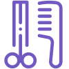

<h2 align="center">
  
  
</h2>

<h1 align="center">
  GoBarber API
</h1>

  💈 A barbershop service scheduling system 💈

 

## Technologies used
- NodeJS with ES6+
- Express
- Sequelize
- Mongoose
- Message Queue with [bee-queue](https://github.com/bee-queue/bee-queue)
- [JWT authentication](https://jwt.io)

Databases: 
- PostgreSQL, for the main application data
- MongoDB, for the notification system
- Redis, for message queue management

Linting and editor configuration:
- [ESLint](https://github.com/eslint/eslint)
- [EditorConfig](https://github.com/editorconfig/)
- [Prettier](https://github.com/prettier/prettier)

Other tools:
- [Babel](https://github.com/babel/babel)
- [Sucrase](https://github.com/alangpierce/sucrase)
- [date-fns](https://github.com/date-fns/date-fns)
- [Insomnia](https://github.com/getinsomnia/insomnia)
- [Nodemailer](https://github.com/nodemailer/nodemailer)
- [Nodemon](https://github.com/remy/nodemon)
- [Sentry](https://github.com/getsentry/sentry)
- And, even though it's a small project, I also decided to use the [Gitflow Workflow](https://www.atlassian.com/git/tutorials/comparing-workflows/gitflow-workflow)

## Start me up! 🚀
1. Clone the repository
2. Install the dependencies: `yarn` or `yarn install`
3. Setup your `.env` file, following the `.env.example`
  3.1 You'll need to setup the following service accounts:
    - [Sentry.io](https://sentry.io/), if you'd like to debug the app errors
    - [Mailtrap.io](https://mailtrap.io/), if you'd like to test the email notifications
4. Setup your databases: _PostgreSQL_, _MongoDB_ & _Redis_
5. Run the _Sequelize seeders_: `yarn sequelize db:seed`
6. Run the _Sequelize migrations: `yarn sequelize db:migrate`
7. Start the app with `yarn dev` or `yarn dev:debug` if you're in VS Code.

Now that you're all setup, let's fire up some http requests via Insomnia. You can import the Insomnia workspace [here](https://gist.github.com/heronsilva/7bd7b44eff42311873d7196fc8a88df5).

<a target="_blank" href="https://icons8.com/icons/set/barbershop">Barbershop</a> icons by <a target="_blank" href="https://icons8.com">Icons8</a>

### Enjoy 🎉
